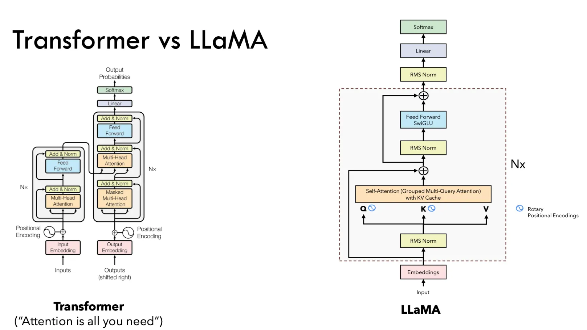
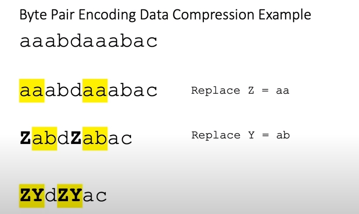
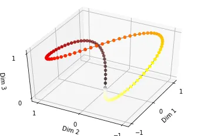
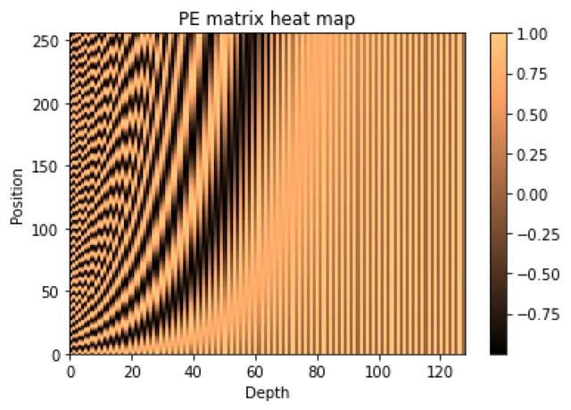
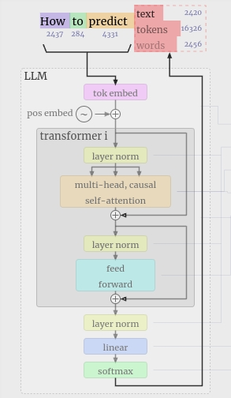
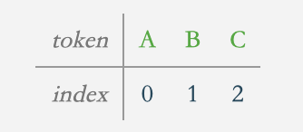
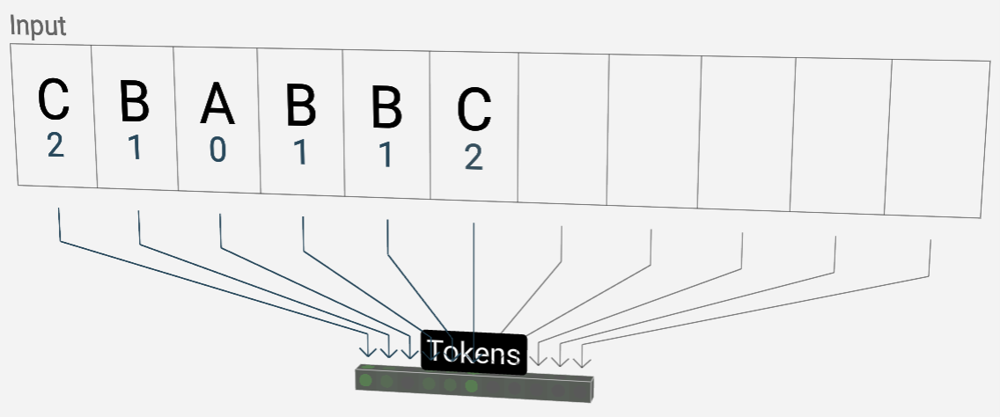
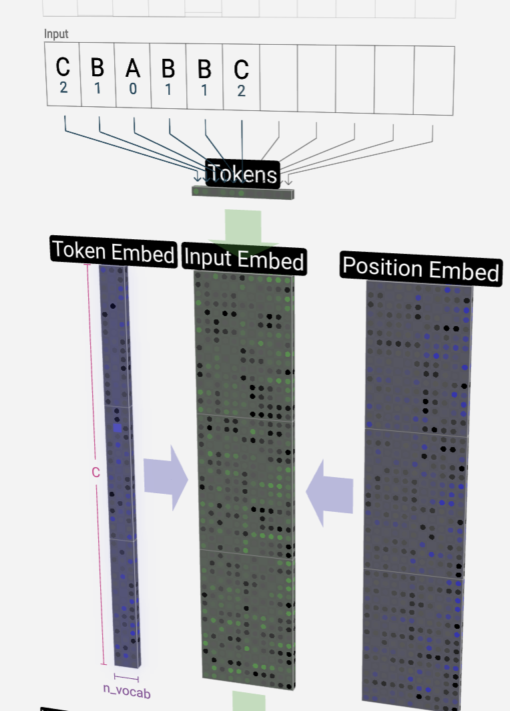

前一段时间，接触板端部署大语言模型，对于大模型几乎0基础的我，不得不一边了解板端部署的方法让模型能快速跑起来，同时一边学习llm的一些基本理论知识来理解为什么这样可以跑起来，以及在遇到问题时可以很好的解决而不是误打误撞。  

如果你也是llm新手玩家，那么可以参考本文来理解一些基本的知识，比如如何为模型分词、什么是词嵌入、什么是位置编码、什么是transformer、什么是self-attention自注意力机制......  

同时，本文在部分章节，会结合llama2的具体模型架构来展开介绍。

# 1 需要学习的零件
transformer框架是大语言模型的基础，transformer以一些列的token作为输入，流经多层encoder、多层decoder以及一些适当的归一化和softmax后，输出下一个token。 

  

从上图transformer的结构可见，transformer可以分成2部分，左encoder和右decoder，而llama架构只用了tranformer的decoder部分，是decoder-only架构，或者说目前大部分生成式的语言模型都是采用这种decoder-only架构。  
llama和llama2在模型架构上基本一致，llama2架构如上图右半部分，llama2架构共用了32(N*)个Decoder层。llama2与原始transformer中decoder的不同主要在于：
1. 将transformer中的LayerNorm换成了RMSNorm
2. 将transformer中的self-attention自注意力机制中的多头注意力Multi-Head Attention换成了GQA(Grouped Multi-Query Attention)
3. 将embedding层后的位置编码Positional Encoding换成了Rotaty Positional Embedding，即RoPE，并将其作用于self-attention阶段  

本文将transformer架构以及其输入输出拆分为多个零件进行讲解：
- tokenization，使用Tokenizer将连续的文本序列转换为离散的token，作为transformer嵌入embedding层的输入
- embedding，本质是一个查找表。首先将词汇表映射到一个'd'维的特征空间，然后通过输入的token对应的index来查找'd'维词向量，每个维度代表一个词特征
- position encoding，模型需要词的位置信息，就像人类阅读文本，需要获取上下文关系，因此需要一种编码把token的位置信息传递给模型
- transformer-decoder，把'embedding'和'position encoding'以某种方式整合后，经过一些列的'Layer Norm','Self-Attention','MLP'和'Softmax'...后为词汇表中的每个词生成一个分数(每个词是下一个输出token的概率)。这些分数有一个特殊的名称：'logits'，可以通过直接取最大值和采样的方法输出最终的token

# 2 分词器Tokenizer

使用模型前，需要使用tokenizer处理输入的文本序列，输出是一系列的token序列。tokenizer总体上做三件事情：
- 分词，tokenizer将字符串分为一些sub-word token字符串，再将token 字符串映射到index，并保留该映射关系的mapping。从字符串到index的encode过程和从index到字符串的decode过程都需要该mapping
- 扩展词汇表
- 识别并处理特殊token  

这里着重介绍'分词'。
## 2.1 word-based按word拆分句子的古典分词器

将一个word作为最小单元，也就是根据空格或者标点、语法等分词，局限性：  
- 对于未在词表中出现的词out of vocabulary，OOV,模型将无法处理，未知符号标记为[UNK]
- 词表中的低频/稀疏词在模型训练无法得到训练 
- 很多语言难以用空格进行分词

## 2.2 char-based按单个字符拆分句子的方法

更为极端的分词方法，直接把序列分成一个一个的字母和特殊符号。虽然能解决OOV问题，也避免了大词汇量问题，但缺点明显：  
- 粒度太细 
- 训练花费成本太高，由于字符数量太小，为每个字符学习嵌入向量的时候，每个向量就容纳了太多的语义在内，学习起来非常困难

## 2.3 subword-based改进的分词器方法

基于子词的分词方法（Subword Tokenization），遵循“尽量不分解常用词，将不常用词分解为常用的子词”的原则。例如"unfriendly"在英文中是un+副词的组合，表否定的意思，可以分解成un”+"friendly"。"friendly"又可以分为名词+ly的形式。通过这种方法，词汇量大小不会特别大，也能学到词的关系，在能缓解oov问题同时还尽可以将结果中token数目降到最低。  

主流的subword算法有：
- Byte Pair Encoding, BPE，被GPT族的模型广泛使用。核心思想在于将最常出现的子词对合并，直到词汇表达到预定的大小时停止。 
- WordPiece，一种字词粒度的tokenize算法，很多transformer模型都使用，如BERT等。原理和BPE非常相似，不同之处在于它做合并时，并不是直接找最高频的组合，而是找能够最大化训练数据似然的来合并，即它每次合并的两个字符A和B，应该具有最大的P(AB)/P(A)P(B)值。
- Unigram，与WordPiece一样，Unigram Language Model(ULM)同样使用语言模型来挑选子词。不同之处在于，BPE和WordPiece算法的词表大小都是从小到大变化，属于增量法。而ULM则是减量法,即先初始化一个大词表，根据评估准则不断丢弃词表，直到满足限定条件。ULM算法考虑了句子的不同分词可能，因而能够输出带概率的多个子词分段。 
- SentencePiece，谷歌推出的子词开源工具包，其中集成了BPE、ULM子词算法。除此之外，SentencePiece还能支持字符和词级别的分词。SentencePiece主要为多语言模型设计，做了以下两个主要的转化： 1.以unicode方式编码字符，将所有的输入(英文、中文等不同语言)都转化为unicode字符，解决了多语言编码方式不同的问题;2. 将空格编码为'_'，这也是为了能处理多语言问题，比如英文解码时有空格，而中文没有。

## 2.4 Byte-Pair Encoding: Subword-based tokenization algorithm
由于比较流行的模型架构都使用了BPE分词法，比如从GPT-2开始一直到GPT-4，OpenAI一直采用BPE分词法，llama架构的模型也是使用BPE分词法。所以这里举一个例子来详细介绍"最先进的 NLP 模型使用的基于子词的标记化算法 - 字节对编码 (BPE)"。  

实际上，BPE 是一种简单形式的数据压缩算法，把序列中最常见的一对儿连续数据字节替换为该序列数据中不存在的字节。举个简单例子：
- 假设数据 'aaabdaaabac' 需要编码（压缩）。因为字节pair 'aa' 最常出现，将其替换为 Z，因为 Z 现有的数据中不存在。现在有了 ZabdZabac，其中 Z = aa。

- 下一个最常出现字节pair是 ab，因此将其替换为 Y。现在有 ZYdZYac，其中 Z = aa 且 Y = ab。

- 剩下的唯一字节pair是 ac，但当前序列中仅有一个ac，因此不会对其进行编码。但此时可以使用递归字节对编码将 ZY 编码为 X。数据现在已转换为 XdXac，其中 X = ZY、Y = ab、Z = aa。此时无法进一步压缩，因为没有字节对出现多次。

- 相反，通过按相反顺序执行替换就可解压缩数据。  

以上是基本的BPE算法的流程，NLP 中使用了这种算法的变体，具体例子如下：  

### Step 1. 准备数据
- 假设现在有一个语料库，其中包含单词——old、old、finest 和 lowest，假设这些单词在语料库中出现的频率如下：  
```{“old”: 7, “older”: 3, “finest”: 9, “lowest”: 4}```
- 每个单词的末尾添加一个特殊的结束标记“<\/w>”：  
```{“old</w>”: 7, “older</w>”: 3, “finest</w>”: 9, “lowest</w>”: 4}```  
每个单词末尾添加“<\/w>”标记来标识单词边界，以便算法知道每个单词的结束位置。这有助于算法查看每个字符并找到频率最高的字符配对

### Step 2. 开始迭代
  
首先，将每个单词拆分为字符并计算它们的出现次数。初始标记将是所有字符和“<\/w>”token。  

BPE 算法的下一步是寻找最频繁的字节对(在这里，将字符视为与字节相同。这是英语的情况，在其他语言中可能会有所不同)，合并它们，并一次又一次地执行相同的迭代，直到达到token数量限制或迭代限制  

所以现在，对于这个例子，将合并最常见的'字符对'以形成一个token，并将该token添加到token列表中，并重新计算每个token的频率。这意味着频率计数将在每个合并步骤后发生变化。然后继续执行此合并步骤，直到达到迭代次数或达到token列表的数量限制。

- Iteration 1: 从除<\/w>特殊token外的第二个最常出现的token “e” 开始，带有字符“e”的最常出现字符对是<e, s>，分别在“finest”和“lowest”中出现9次和4次，共13次。因此，将它们合并形成一个新的token “es”，并记下其频率为 13。同时，把token “e”和“s”的出现次数减去 13。更行后的token列表如下：  


- Iteration 2: 合并token “es”和“t”。因为，字符对<es, t>在语料库中出现了 13 次(最高)。因此，产生一个频率为 13 的新token “est”，同时把“es”和“t”的频率减去 13。更行后的token列表如下：  


- Iteration 3: 合并字符对<est, <\/w>>，因为“est<\/w>”在预料库中出现了13次(最高)。因此，产生一个频率为 13 的新token “est<\/w>”，同时把“est”和“<\/w>”的频率减去 13。更行后的token列表如下：  

合并停止标记“<\/w>”非常重要。这有助于算法理解“estimate”和“highest”等词之间的区别。这两个词都有一个共同点“est”，但highest以“est”结尾，estimate以“est”开头。因此，像“est”和“est<\/w>”这样的token将以不同的方式处理。如果算法看到标记“est<\/w>”，它将知道它是单词“high”的token，而不是单词“estate”的token。

- Iteration 4: 现在，语料库中的字符对<l, o>出现次数最多，old中7次，older中3次，共10次。同理，更新后的token列表如下：  


- Iteration 5: 然后合并出现10次的字符对<lo, d>，更新后的token列表如下：  


### Step 3. 停止迭代
5次迭代后，语料库中剩余没合并的字符集为：```{“</w>”: 7, “er</w>”: 3, “fin”: 9, “low”: 4}```，同时从token列表中删去频率为0的token后，现在的token列表为：  


此时，“f”、“i”和“n”的频率是 9，“o”、“l”、“w”的频率是 4，“e”、“r”的频率是 3，但只有一个单词包含这些字符，因此不会继续将它们合并。现在可以看到总token数为 11，这比初始的 12 少1(因为这是一个很小的语料库，但在实践中，大小应该会减很多)。这个包含 11 个标记的列表将作为最终的词汇表，上图中第一列即为对应token的index。

- decode容易，示例：首先根据模型的输出(token对应的index)，映射成到具体的编码序列```[“the</w>”, “high”, “est</w>”, “range</w>”, “in</w>”, “Seattle</w>”]```将被解码为``` [“the”, “highest”, “range”, “in”, “Seattle”]```
- encode难，计算成本很高。假设单词序列为 ```[“the</w>”, “highest</w>”, “range</w>”, “in</w>”, “Seattle</w>”]```。我们将迭代token列表中所有token（从最长到最短），并尝试使用这些token替换给定单词序列中的sub字符串。如果仍有一些sub字符串没被替换（对于模型在训练中没有看到的单词），将用 [UNK] token替换。最后查找token和index的mapping，得到一个数字序列，型如[8774, 1150, 55, 1],作为Embedding层的输入。  
实际会得到一个4*V的矩阵，V是词表的大小，比如51200。矩阵第一行的第8774列为1,其他全为0。矩阵的第二行的第1150列为1,其他全为0。矩阵的第三行的第55列为1,其他全为0。矩阵的第四行的第1列为1,其他全为0。

# 3 Embedding
词向量，英文名叫Word Embedding，按照字面意思，应该是词嵌入。假如一个模型的Embedding层维度是d, 那么对于token序列如[8774, 1150, 55, 1]来说，会通过“查表”的方式得到一个d×4的嵌入矩阵，来表示模型的输入，矩阵的每一列代表一个token的高维词向量。  
实际上Embedding层是以 'one hot' 为输入、中间层节点为词向量维数的全连接层！而这个全连接层的参数，就是一个“词向量表”。  
要想明白Word Embedding到底是怎么一回事，还得先了解一下'one hot'。  

## 3.1 one hot
one hot，中文可以翻译为“独热”，是最原始的用来表示字、词的方式。为了简单，本文以word为例。假如词表中一共有“I、love、you、dog、are、eat”6个word，one hot就是给这六个word分别用一个0-1编码：
```
- you : [1,0,0,0,0,0]
- love: [0,1,0,0,0,0]
- I   : [0,0,1,0,0,0]
- dog : [0,0,0,1,0,0]
- are : [0,0,0,0,1,0]
- eat : [0,0,0,0,0,1]
```
那么，如果表示“I love dog”就可以用矩阵
```
- I   : [0,0,1,0,0,0]
- love: [0,1,0,0,0,0]
- dog : [0,0,0,1,0,0]
```
可以看到，one hot的方式下，有多少个字，就得有多少维向量，假如有1万字，那么每个字向量就是1万维。但有点是这样的矩阵参与计算是十分好计算

## 3.2 Embedding层真面目
考虑以下计算：  


左边的形式表明，这是一个以2x6的 one hot 矩阵的为输入(来表示'you love')、中间层节点数为3(或者说嵌入层的维度)的全连接神经网络层。而右边，就是相当于在w矩阵中取出第一行和第二行，这就是为何说”Embedding矩阵的本质就是一个查找表“：可以通过一个one hot向量取出v×d矩阵中的第i行，v是词表大小，d是嵌入层的维度，i是该one hot向量为1的index。因此使用一个seq_len长度的序列，会得到一个seq_len×d的嵌入矩阵，该矩阵的没一行代表一个d维的词向量。

可以看到，实际上Embedding层就是以one hot为输入、中间层节点为词向量维数的全连接层。而这个全连接层的参数，就是一个“词向量表(上图中的w矩阵)”！从这个层面来看，词向量没有做任何事情！它就是一种one hot，只不过词向量是one hot的全连接层的参数而已。 

- 运算层面的，基本上就是通过研究发现，one hot型的矩阵相乘，就像是相当于查表，于是它直接用查表作为操作，而不写成矩阵再运算，这大大降低了运算量(降低了运算量不是因为词向量的出现，而是因为把one hot型的矩阵运算简化为了查表操作)。
- 思想层面的，就是它得到了这个全连接层的参数之后，直接用这个全连接层的参数作为特征，或者说，用这个全连接层的参数作为字、词的表示，从而得到了字、词向量，最后还发现了一些有趣的性质，比如向量的夹角余弦能够在某种程度上表示字、词的相似度。

# 4 position encoding
词的位置和顺序是任何语言的基本组成部分。但对于模型而言，句子中的每个单词同时流经内部的，因此模型本身对每个单词没有任何位置/顺序感。比如，对于输入序列[a1,a2,a3,a4]：  
1. 绝对位置信息。a1是第一个token，a2是第二个token......
2. 相对位置信息。a2在a1的后面一位，a4在a2的后面两位......
3. 不同位置间的距离。a1和a3差两个位置，a1和a4差三个位置.... 

这些信息对模型来说，是无法分辨的。因此，需要一种方法将词的顺序合并到模型中。  
为模型提供某种顺序感的一种可能的方法是向每个词添加一条有关其在句子中的位置信息，称之为“信息片段”，即 position encoding 位置编码。  

构造位置编码的演变历程：  
- 用整型值标记位置
- 用[0,1]范围标记位置
- 用二进制向量标记位置
- 用连续的二进制向量来表示位置
- 用sin和cos交替来表示位置

## 4.1 用整型值标记位置
  
最简单的方式就是给每个token一个index。但这种方法有以下几个主要问题：
- 模型可能遇见比训练时所用的序列更长的序列。不利于模型的泛化
- 模型的位置表示是无界的。随着序列长度的增加，位置值会越来越大

## 4.2 用[0,1]范围标记位置
  
把所有index值除以最大的index，这样所有值都在 [0,1] 之间。比如有3个token，那么位置信息就表示成[0, 0.5, 1]；若有四个token，位置信息就表示成[0, 0.33, 0.69, 1]。但这样会带来别的问题：
- 不适用于可变序列长度。即，不能处理任意长度的序列，因为每个inedx都除以(序列长度-1)，所以位置编码值（例如 0.8）对于长度为 5 的序列的含义与对于长度为 20 的序列的含义是完全不同的  

因此，需要这样一种位置编码方式，要同时满足：
1. 能用来表示一个token在序列中的绝对位置
2. 在可变序列长度的情况下，不同序列中token的相对位置/距离要保持一致
3. 可以用来表示模型在训练过程中从来没有看到过的序列长度

## 4.3 用二进制向量标记位置
考虑到位置编码要作用在词向量input embedding上，因此比起用单一的标量，更好的方法是用一个和input embedding维度一样的向量来表示位置。这时就很容易想到二进制编码。如下图，假设d_model = 3，那么位置向量可以表示成：  
  

这下所有的值都是有界的（位于0，1之间），且transformer中的维度d_model本来就足够大，比如4096维，基本可以把每一个位置都编码出来了。  

但是这种编码方式也存在问题：这样编码出来的位置向量，处在一个‘离散’的空间中，不同位置间的变化是不连续的。假设d_model = 2，有4个位置需要编码，这四个位置向量可以表示成[0,0],[0,1],[1,0],[1,1]。可以通过下图把它的位置向量空间表示出来：  

   

如果有一种方法能把离散空间（黑色的线）转换到连续空间（蓝色的线），那么就能解决位置距离不连续的问题。同时，不仅能用位置向量表示整型，还可以用位置向量来表示浮点型

## 4.4 用连续的二进制向量来表示位置
使用[-1,1]上存在的正弦函数sin，是一个很好的选择。  

先举一个直观的例子，感受使用连续二进制所传递的思想。下图每个仪表盘可以想象成音箱上控制音量的旋钮，每个旋钮的灵敏度不同。每个旋钮可以从‘0’扭到‘1’，‘0’
代表调整音量到该旋钮可调节的最小值(即关闭这个旋钮上的音量)，‘1’代表调整音量到该旋钮可调节的最大值。因此，从‘0’到‘1’的过程是连续的，不再是离散的。  

[试着把控制'音量'想象成控制'位置'，模型输入序列中的每个位置都由位置嵌入向量（本图中的每一行）表示，可以将其可视化为一组旋钮的设置。旋钮盘描绘的是矩阵元素。随着词嵌入维度d_model的增加，旋钮盘变得更加灵敏，因此'位置'也增加得更多]

为了获取更高精度的音量调节，可以使用具有不同灵敏度的一系列旋钮（向量），第一个旋钮会稍微调整音量，也许是 1 个单位，几乎听不见差异。第二个旋钮可调节 2 个单位的音量。第三个将调整 4 个单位，第四个调整 8 个单位，依此类推。  

通过这种方式，可以获得大范围内的音量精度，因为旋钮精度/灵敏度呈指数级增加。比如，可以构建 8 个具有同样精度的小旋钮（2⁸=256），来代替构建一个包含 512 个声级的巨大旋钮盘。可见效率极大的被提升。  

如何让正弦函数sin在正确的时刻从0旋转到1？  
直觉上来看：对于没一行的第一个旋钮，每次在输入序列中移动一个位置时，它都应该完成 ‘0 →1’ 的旋转并返回。这意味着第一个旋钮需要 M_PI/2 的频率，即sin(M_PI/2 * 2^0)，第二个旋钮需要 M_PI/4 的频率，即sin(M_PI/4 * 2^1)，第三个旋钮需要 M_PI/8 的频率，即sin(M_PI/8 * 2^2)......  

现在，假设有一个矩阵M，M有n行，d列，表示n行d维的位置向量，那么M个每个元素可以表示为：  

  
w_j是正弦函数的频率，随着维度d的增减单调递减。而X_i是表示序列中位置的整数  

目前看似已经很完美了，但是由于sin是周期函数，如果频率偏大，导致函数波长偏短，则不同X_i下的位置向量可能出现重合的情况。比如下图：表示维度d_model为3时（每个维度的频率W_i分别为M_PI/2,M_PI/4和M_PI/8），每个token的位置向量，图中的颜色越深表示token位置越靠后，在频率偏大的情况下，位置向量连成了一个闭环，即靠前位置和靠后位置竟然靠的非常近
   

为了避免这种情况，就要把函数的波长拉长，一种简单的方法是统一把所有频率都设成非常小的值:  
   

W_0是最小频率，j=0和j=d_model分别可以得到最大频率1和最小频率W_0。原论文的作者选择1/10000作为最小频率，代入后可以得到频率：1/(10000^(j/(d_model-1)))，j是代表第j维。  
通过正弦函数和缩放其频率可以达到即连续又不重合的效果。  
假设长度为seq_len的序列的位置编码矩阵为PE，则PE：  


行向量 v 是在单个位置 x 上计算的正弦向量，但每个维度上的频率不同：  
  

## 4.5 用sin和cos交替来表示位置
截至目前，使用连续的正弦函数表示位置向量，实现了以下功能：
- 当sin函数的频率足够小，每个token的位置向量唯一
- 位置向量的值是有界的[0,1]，且位于连续空间中
- 模型在处理位置向量时更容易泛化，即可以处理长度和训练数据分布不一致的序列

现在对位置向量再提出一个要求：不同的位置向量要可以通过线性转换得到。  

这样，不仅可以表示单个token的绝对位置，还可以表示token与token之间的相对位置，即可以通过T(detal_x)的线性变换从位置x的编码得到位置(x+detal_x)的编码：  
   

通过三角函数的性质：
- sin(A+B)=sinAcosB+cosAsinB
- cos(A+B)=cosAcosB-sinAsinB

可以得到下面的矩阵变换：  
  

等号右边可以看作是，向量(cos日，sin日)通过一个变换矩阵，得到等号左边的向量(cos(日+中)，sin(日+中))，可以理解为通过这个变换，从位置x直接得到位置(x+detal_x)的编码。  

所以现在可以很轻松的交替使用正弦和余弦函数来构建出新的位置编码矩阵，其中矩阵中的每个行向量，也就是输入序列的每个位置上的位置编码可以表示为：  
   

并通过以下变换矩阵从位置x得到位置(x+detal_x)上的位置编码：  
   

### 4.5.1 位置编码可视化
下图是一串序列长度为250，位置编码维度为128的位置编码可视化结果：  
  
可以发现，由于正弦余弦的性质，位置向量的每一个值都位于[-1, 1]之间。同时，纵向来看，图的右半边几乎都是黄色的，这是因为越往后的位置，频率越小，波长越长，所以不同的t对最终的结果影响不大。而越往左边走，颜色交替的频率越频繁。

### 4.5.2 位置编码的重要性质
- 两个位置编码向量的点积(dot product)仅取决于偏移量detal_x
，也即两个位置编码的点积可以反应出两个位置编码间的距离。
- 位置编码的点积是无向的，即只能表示相对距离，不能表示token在方向上的关系，谁前谁后

## 4.6 旋转式位置编码RoPE
“旋转式位置编码（Rotary Position Embedding，RoPE）”，这是一种配合Attention机制能达到“绝对位置编码的方式实现相对位置编码”的设计。而也正因为这种设计，它还是目前唯一一种可用于线性Attention的相对位置编码。  
推导比较麻烦，暂时不介绍。  
性能很好，据我所知，主流的模型，比如llama架构，Qwen，GPT等都是使用的RoPE。

# 5 transformer-decoder
开始正式进入深水区...  
这一章会结合一个小规模(85000参数量)的模型，nano-gpt，来过一遍transformer和核心的decoder层，nano-gpt的架构如下图所示：  
  
从一个简单的例子展开，输入一个六个字母的序列“C B A B B C”，按字母顺序对它们进行排序，即输出“A B B B C C”。  

简单起见，将每个字母视为一个token，则模型的词汇表是：  
  

那么可以得到一个token index的序列：2 1 0 1 1 2，输入序列长度T为6。  
  

该模型的词嵌入层的嵌入参数是一个n_vocab*C的矩阵Token_Embed，n_vocab是词表大小，在本例中只有“A B C”三个，所以词表大小为3，C是嵌入层维度，本例为48维。  

根据之前章节说的，嵌入层的本质是查表，所以根据每个token的index从Token_Embed中取出相应的词向量，得到一个6*48的词向量矩阵。  

然后将词嵌入矩阵与对应的6*48的位置编码参数矩阵Position Embedding逐元素相加，得到最终的输入input embedding矩阵，矩阵的形状是T*C，也即6*48：  
  

随后 Input Embed 流经模型，经过一系列称为transformer的层，然后得到一个输出output  
  

得到的output就是下一个token的预测，即下一个token为‘A’、‘B’或‘C’的概率。  

## 5.1 Layer Norm
层归一化